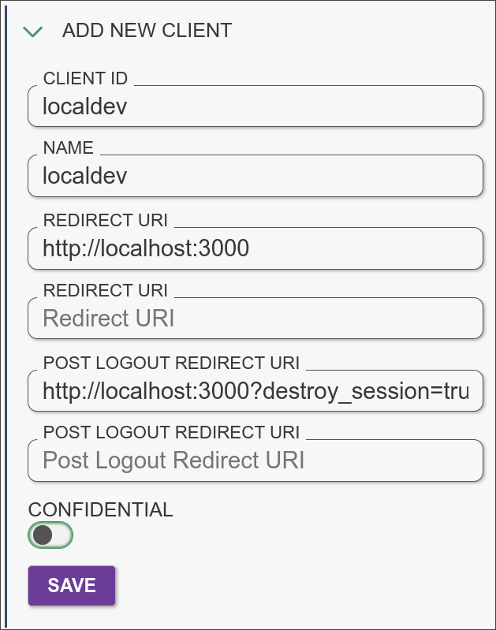
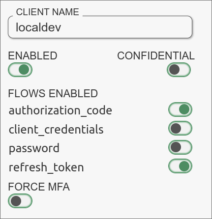
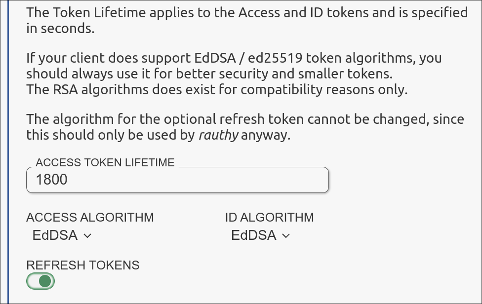

# Rauthy

This guide should help you setting up **leptos_oidc** with [rauthy](https://github.com/sebadob/rauthy).

## Start rauthy

You can easily run rauthy by using this docker command:

```bash
docker run --rm -p 8080:8080 ghcr.io/sebadob/rauthy:0.17.0-lite
```

After that you can visit the [clients page](http://localhost:8080/auth/v1/admin/clients)
and setup the client.

## Setup rauthy

First of all you need to add a client in rauthy. You can give them a name
whatever you want. the important part is the `post_logout_redirect_uri`.
That needs to point to your entry which you are settings in **leptos_oidc**.
Please keep in mind that **leptos_oidc** is appending the query parameter `?
destroy_session=true` automatically. And of course don't forget the `redirect_uri`. \
{width=30%}

After that you need to enable the `refresh_token` in your flows. This adds the
capability to refresh the `access_token` with the `refresh_token`. Also please
keep in mind that the client is NOT a `confidential` client. \
{width=30%}

It's not only mandatory to enable the `refresh_token flow`, it's also mandatory
to append the `refresh_token` to the response. \
{width=30%}

## Setup leptos_oidc

All you need to do is to setup everything with the init function. In this
example the config would look like this:

```rust
use leptos::*;
use leptos_oidc::Auth;

#[component]
pub fn App() -> impl IntoView {
    provide_meta_context();

    view! {
        <Stylesheet id="leptos" href="/pkg/main.css"/>

        <Link rel="shortcut icon" type_="image/ico" href="/favicon.ico"/>

        <Router>
            <AppWithRouter/>
        </Router>
    }
}

#[component]
pub fn AppWithRouter() -> impl IntoView {
    // Specify OIDC authentication parameters here.
    // Note: This is an example for rauthy, please change it to your needs
    let auth_parameters = AuthParameters {
        issuer: "http://localhost:8080/auth/v1".to_string(),
        client_id: "localdev".to_string(),
        redirect_uri: "http://localhost:3000".to_string(),
        post_logout_redirect_uri: "http://localhost:3000".to_string(),
        challenge: Challenge::S256,
        scope: None,
        audience: None,
    };
    let auth = Auth::init(auth_parameters);

    view! {
        // Your stuff
    }
}
```
